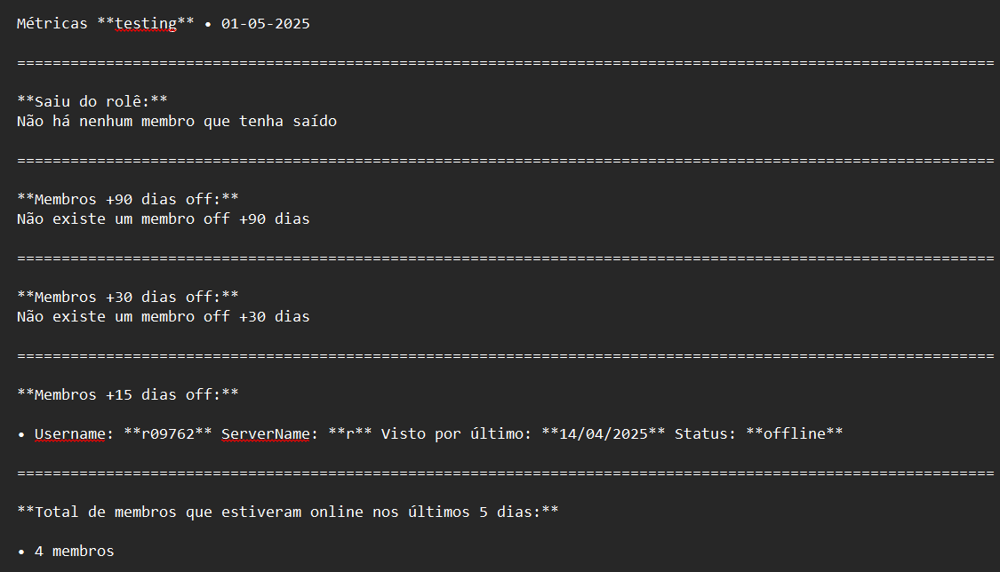

# io-activity-monitor

**io-activity-monitor** é um bot de monitoramento de atividade para servidores Discord.
Ele registra quando membros saem do servidor, monitora o tempo de inatividade dos usuários e gera um arquivo .txt com métricas do servidor.

## Funcionalidades

- Detecta saídas de membros do servidor.
- Monitora a presença e o tempo de inatividade dos membros.
- Gera um arquivo .txt contendo métricas do servidor, como:
  - Quem saiu do servidor
  - Membros +90 dias off
  - Membros +30 dias off
  - Membros +15 dias off
  - Total de membros que estiveram online nos últimos 5 dias

## Exemplo de arquivo .txt gerado

## Tarefas

### Implementações

- [ ] Adicionar funcionalidade para exibir no relatório os membros que entraram no servidor nos últimos 30 dias.

### ❓Perguntas

- Como faço para rodar o projeto na minha máquina?

  Você pode seguir o [Guia de instalação](https://github.com/raphaelkauan/io-activity-monitor/blob/main/GUIA_INSTALACAO.md).

- Onde posso pedir ajudar?

  Você pode criar uma [Issue no repositório](https://github.com/raphaelkauan/io-activity-monitor/issues).

- Como faço para contribuir com o projeto?

  Você pode seguir essa [Documentação](https://docs.github.com/pt/get-started/exploring-projects-on-github/contributing-to-a-project).

---

  © 2025 Bot Discord

